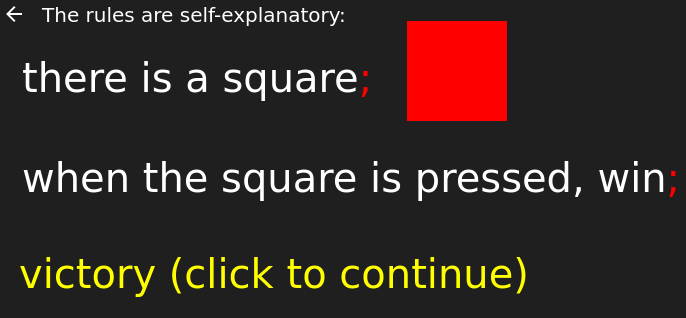

> _In the beginning was the Word, and the Word was with God, and the Word was God. [...]
> Through him all things were made; without him nothing was made that has been made._
>
> \- John 1:1-3

Semantic Construct is a puzzle game about building a world with words.

## Overview

You can play [here](https://eutro.github.io/semantic-construct).

Rules are written in relatively simple and mostly correct English:

Drag around words to create and modify the very rules of the world:

## Setup

To get an interactive development environment run:

    lein figwheel

and open your browser at [localhost:3449](http://localhost:3449/).
This will auto compile and send all changes to the browser without the
need to reload. After the compilation process is complete, you will
get a Browser Connected REPL. An easy way to try it is:

    (js/alert "Am I connected?")

and you should see an alert in the browser window.

To clean all compiled files:

    lein clean

To create a production build run:

    lein do clean, cljsbuild once min

And open your browser in `resources/public/index.html`. You will not
get live reloading, nor a REPL. 

## License

See [LICENSE](LICENSE).
